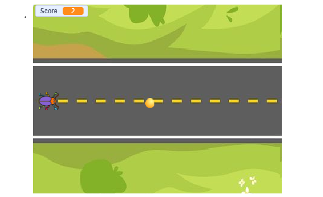

#**CS50 PSet0: Beetle Ball**  
**Status**: Completed✅ ┃ Score: 8/8 on check50  

###**🎮Play the game**  
**Link**:[Click here to play on scratch](https://scratch.mit.edu/projects/1323935678)  

###**📝Description**  
Control a beetle by up and down arrow keys to dodge the coming balls. Score keeps increasing till u die.  

###**🧠CS50 Concepts used**  
-Events: When green flag clicked, when up and down arrow keys pressed, when play button clicked  
-Loops: Forever loop for game movement, ball spawning  
-Conditionals:If beetle touches ball then game over  
-Variables: Score variable that increases over time  
-Clones: Create clone of ball sprite for multiple obstacles  
-Custom blocks:move,play,run,score,motion used for movement of ball, controlling beetle,changing score over time  

###**📸Screenshot**  

_ _ _
Built for Harvard CS50 Week 0
